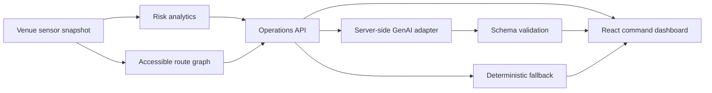

# Matchday Ops AI

Public repository: [vivekyarra/matchday-ops-ai](https://github.com/vivekyarra/matchday-ops-ai)

Matchday Ops AI is a GenAI-enabled stadium operations command center for the FIFA World Cup 2026 challenge vertical: **Smart Stadiums & Tournament Operations**.

It gives venue staff a live operating picture for crowd flow, accessibility, transport, sustainability, and incident response. The system combines deterministic venue analytics with a server-side Gemini-compatible decision assistant so every AI recommendation is grounded in the current stadium snapshot and still requires human approval.

## Chosen vertical

**Smart Stadiums & Tournament Operations**

The project focuses on venue staff and organizers during matchday operations. It targets these use cases:

- Crowd management and queue pressure detection
- Accessible routing for guests with mobility, low-vision, or sensory needs
- Multilingual fan guidance for public announcements
- Transport and arrival pressure monitoring
- Sustainability operations, including water, waste, energy, and reusable cup return signals
- Real-time decision support for operations, security, accessibility, transport, and sustainability leads

## Approach and logic

The solution is intentionally split into deterministic logic and GenAI logic.

Deterministic logic handles safety-critical calculations:

- Zone risk scoring uses load, queue time, staff gap, incident severity, accessibility readiness, and sensor health.
- A 15-minute occupancy projection highlights zones likely to worsen before kickoff.
- Accessible routing uses weighted graph search and removes non-accessible paths when mobility support is required.
- Sustainability scoring combines energy load, waste diversion, refill utilization, and cup return rate.

GenAI logic handles language, synthesis, and operator briefing:

- The backend creates a compact stadium snapshot and sends only that context to the model.
- The model is instructed to return strict JSON with summary, risk level, actions, public message, accessibility note, sustainability note, and assumptions.
- The response is schema-validated before it reaches the UI.
- If `GEMINI_API_KEY` is missing or the AI request fails, the app falls back to deterministic demo-safe recommendations so evaluators can run the full project without secrets.

## How the solution works



Main screens:

- **Operations map:** interactive stadium map with live risk markers and selected-zone details.
- **Zone priorities:** table view of load, queue, staff coverage, and risk scores.
- **Venue signals:** open incidents, transit load, arrival timing, and sustainability readiness.
- **Ops briefing:** GenAI decision support for staff actions and public messaging.
- **Accessible route:** route planner that respects mobility requirements and crowd pressure.

## Tech stack

- React 19 + TypeScript + Vite
- Node.js + Express
- Zod request and response validation
- Helmet, CORS, JSON size limits, rate limiting
- Vitest, Supertest, Testing Library, axe-core
- Gemini REST-compatible server adapter with deterministic fallback

## Run locally

```bash
npm install
npm run dev
```

Open `http://127.0.0.1:5173`.

The API runs on `http://127.0.0.1:8787`.

## Optional Gemini setup

The project works without an API key. To enable live Gemini calls, create `.env` from `.env.example`:

```bash
GEMINI_API_KEY=your_key_here
GEMINI_MODEL=gemini-3.5-flash
PORT=8787
```

The API key is read only by the server. It is never sent to the browser.

## Validation

```bash
npm run lint
npm run test
npm run build
npm run check
```

Current test coverage focus:

- Risk scoring and snapshot metrics
- Route risk handling for both origin and destination zones
- Accessible route planning
- API validation, input bounds, and safe AI fallback
- Multilingual deterministic decision support
- Client accessibility smoke test with axe-core

## Security

- Secrets stay server-side in environment variables.
- AI endpoint has rate limiting and an 8-second timeout.
- Request bodies are capped at 32 KB.
- Route endpoint inputs are length-bounded and validated.
- All user input is validated with Zod before domain logic runs.
- AI output is parsed and schema-validated before rendering.
- Helmet sets defensive HTTP headers.
- CORS accepts only local development origins by default or one configured `ALLOWED_ORIGIN`.
- The AI prompt is grounded to supplied venue data and forbids secrets, unsafe crowd-control tactics, and fabricated integrations.
- No personal data, face recognition, biometric tracking, or individual profiling is used.

## Efficiency

- Risk analytics are deterministic and lightweight.
- AI responses are cached briefly to reduce repeated model calls.
- The AI cache is bounded and prunes expired entries.
- Route planning uses a small weighted graph and avoids unnecessary external services.
- The frontend fetches compact JSON payloads and renders from local state.
- Demo mode avoids network dependency during evaluation.

## Accessibility

- Semantic landmarks, headings, labels, table captions, and live regions are used.
- Keyboard-visible focus states are defined globally.
- Icon buttons include accessible labels.
- Controls use native select, checkbox, button, and textarea elements.
- The route planner supports wheelchair, low-vision, and sensory-sensitive profiles.
- AI-generated multilingual text uses automatic text direction where it is rendered.
- The UI is responsive across desktop and mobile viewport widths.
- Automated axe coverage is included in `tests/accessibility.test.tsx`.

## Assumptions

- The venue, sensors, incidents, and transit feeds are realistic demo data, not live FIFA infrastructure.
- Human staff approve every recommendation before execution.
- The app is a decision-support system, not an automated crowd-control system.
- The default model is `gemini-3.5-flash`, but it can be changed with `GEMINI_MODEL`.
- A production deployment would replace the static demo dataset with authenticated venue feeds and an audit log store.

## Evaluation mapping

| Parameter | How this repository addresses it |
| --- | --- |
| Code Quality | Typed React and Express code, shared schemas, separated client/server/domain layers, focused tests |
| Security | Server-side AI key, validation, rate limits, Helmet, CORS, body limits, no PII or biometrics |
| Efficiency | Cached AI decisions, compact snapshots, deterministic scoring, lightweight graph routing |
| Testing | Unit, API, and accessibility smoke tests plus build/lint scripts |
| Accessibility | Semantic UI, keyboard focus, native controls, accessible route logic, axe test |
| Problem Statement Alignment | Directly targets stadium operations, crowd management, multilingual assistance, accessibility, transportation, sustainability, and decision support |
